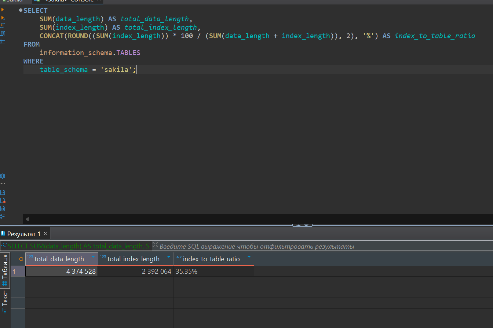

# Индексы

## Задание 1

Напишите запрос к учебной базе данных, который вернёт процентное отношение общего размера всех индексов к общему размеру всех таблиц.

```sql
SELECT
    SUM(data_length) AS total_data_length,
    SUM(index_length) AS total_index_length,
    CONCAT(ROUND((SUM(index_length)) * 100 / (SUM(data_length + index_length)), 2), '%') AS index_to_table_ratio
FROM
    information_schema.TABLES
WHERE
    table_schema = 'sakila';
```



## Задание 2

Выполните explain analyze следующего запроса:

```sql
EXPLAIN ANALYZE
select distinct concat(c.last_name, ' ', c.first_name), sum(p.amount) over (partition by c.customer_id, f.title)
from payment p, rental r, customer c, inventory i, film f
where date(p.payment_date) = '2005-07-30' and p.payment_date = r.rental_date and r.customer_id = c.customer_id and i.inventory_id = r.inventory_id
```

1. Соединения (JOIN): Запрос использует неявные соединения через WHERE, что может привести к неэффективному выполнению. Явные соединения (JOIN) обычно более читаемы и могут быть оптимизированы лучше.
2. Фильтрация по дате: Условие date(p.payment_date) = '2005-07-30' может быть неэффективным, если payment_date не индексирован.
3. Отсутствие индексов: Если на полях, используемых в условиях соединения и фильтрации, нет индексов, это может значительно замедлить выполнение запроса.

```sql
EXPLAIN ANALYZE
SELECT DISTINCT
    CONCAT(c.last_name, ' ', c.first_name) AS customer_name,
    SUM(p.amount) OVER (PARTITION BY c.customer_id, f.title) AS total_amount
FROM
    payment p
JOIN
    rental r ON p.payment_date = r.rental_date
JOIN
    customer c ON r.customer_id = c.customer_id
JOIN
    inventory i ON i.inventory_id = r.inventory_id
JOIN
    film f ON f.film_id = i.film_id
WHERE
    p.payment_date >= '2005-07-30' AND p.payment_date < '2005-07-31';

CREATE INDEX idx_payment_date ON payment(payment_date);

CREATE INDEX idx_rental_date ON rental(rental_date);

CREATE INDEX idx_rental_customer_id ON rental(customer_id);

CREATE INDEX idx_rental_inventory_id ON rental(inventory_id);

CREATE INDEX idx_customer_id ON customer(customer_id);

CREATE INDEX idx_inventory_id ON inventory(inventory_id);

CREATE INDEX idx_inventory_film_id ON inventory(film_id);

CREATE INDEX idx_film_id ON film(film_id);
```

## Задание 3

Типы индексов в PostgreSQL

- B-tree: Это стандартный тип индекса, который используется по умолчанию. Он подходит для большинства операций поиска.
- Hash: Индексы, основанные на хешировании, обеспечивают быстрый доступ к данным, но могут использоваться только для равенства.
- GiST (Generalized Search Tree): Этот тип индекса поддерживает сложные типы данных и позволяет выполнять запросы с использованием различных операторов.
- SP-GiST (Space-Partitioned Generalized Search Tree): Подобен GiST, но оптимизирован для работы с данными, которые могут быть разбиты на области (например, геометрические данные).
- GIN (Generalized Inverted Index): Используется для индексации массивов, JSONB и полнотекстового поиска. Позволяет эффективно выполнять запросы с использованием операторов, таких как @> и ?.
- BRIN (Block Range INdex): Эффективен для очень больших таблиц, где данные имеют некоторую упорядоченность. Индексирует блоки данных, а не отдельные строки.
- Partial Index: Индекс, который создается только для части данных в таблице, что позволяет экономить место и ускорять операции.
- Expression Index: Индекс, основанный на выражении, а не на конкретном столбце. Это позволяет индексировать результаты вычислений.

Индексы, которые есть в PostgreSQL, но отсутствуют в MySQL

- GIN (Generalized Inverted Index): Используется для индексации сложных типов данных, таких как массивы и JSONB.
- BRIN (Block Range INdex): Эффективен для больших таблиц с упорядоченными данными, что позволяет значительно экономить место.
- SP-GiST (Space-Partitioned Generalized Search Tree): Поддерживает специфические типы данных и структуры, которые не поддерживаются в MySQL.
- Partial Index: Индексы, которые создаются только для подмножества строк, что позволяет оптимизировать производительность для определенных запросов.
- Expression Index: Индексы, основанные на выражениях, позволяют индексировать результаты вычислений, что не поддерживается в MySQL.
